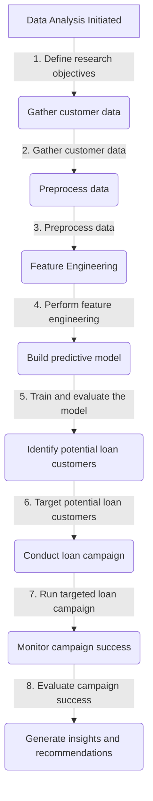

# Predictive Modeling for Targeted Loan Campaign

## Project Background Information.
The objective of this project is to develop a predictive model to assist the marketing department of AllLife Bank in identifying potential customers who are likely to purchase personal loans.
The bank aims to convert its liability customers (depositors) into asset customers (borrowers) to increase its loan business and generate more interest income.
Previously, a campaign targeting liability customers resulted in a successful conversion rate of over 9%. 
This success has motivated the retail marketing department to enhance their target marketing strategies and improve the success ratio of future campaigns.
The model that utilizes customer data and various predictors to identify individuals who have a higher probability of purchasing a personal loan.
By effectively targeting these potential customers, the bank can maximize its marketing efforts, increase loan conversions, and retain customers as both depositors and borrowers.
The model development process will involve analyzing customer data, performing feature engineering, selecting appropriate machine learning algorithms and evaluating the model's performance.
The ultimate goal is to provide the marketing department with actionable insights and recommendations for targeted loan campaigns, enabling the bank to achieve its strategic objectives.

