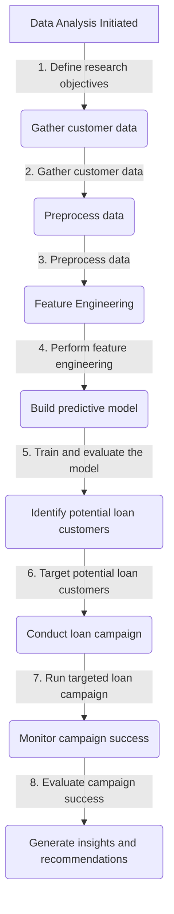

# Predictive Modeling for Targeted Loan Campaign

## Background and Context
AllLife Bank is a US bank that has a growing customer base. The majority of these customers are liability customers (depositors) with varying sizes of deposits. 
The number of customers who are also borrowers (asset customers) is quite small, and the bank is interested in expanding this base rapidly to bring in more loan business and in the process, earn more through the interest on loans. 
In particular, the management wants to explore ways of converting its liability customers to personal loan customers (while retaining them as depositors).
A campaign that the bank ran last year for liability customers showed a healthy conversion rate of over 9% success. 
This has encouraged the retail marketing department to devise campaigns with better target marketing to increase the success ratio.
## Objective
The model that utilizes customer data and various predictors to identify individuals who have a higher probability of purchasing a personal loan.
By effectively targeting these potential customers, the bank can maximize its marketing efforts, increase loan conversions, and retain customers as both depositors and borrowers.
The model development process will involve analyzing customer data, performing feature engineering, selecting appropriate machine learning algorithms and evaluating the model's performance.
The ultimate goal is to provide the marketing department with actionable insights and recommendations for targeted loan campaigns, enabling the bank to achieve its strategic objectives.

## Data Dictionary:
ID: Customer ID
Age: Customer’s age in completed years
Experience: #years of professional experience
Income: Annual income of the customer (in thousand dollars)
ZIP Code: Home Address ZIP code.
Family: the Family size of the customer
CCAvg: Average spending on credit cards per month (in thousand dollars)
Education: Education Level. 1: Undergrad; 2: Graduate;3: Advanced/Professional
Mortgage: Value of house mortgage if any. (in thousand dollars)
Personal_Loan: Did this customer accept the personal loan offered in the last campaign?
Securities_Account: Does the customer have securities account with the bank?
CD_Account: Does the customer have a certificate of deposit (CD) account with the bank?
Online: Do customers use internet banking facilities?
CreditCard: Does the customer use a credit card issued by any other Bank (excluding All life Bank)?

## Recomendation
Income,family, Education, ccavg are the most important features that can contribute to a customer buying a personal loan.
The other features like Exxprience, mortage,credit card, cd_account have no impact in determing if a customer will buy a personal or not.
The size of family of a customer tends to influence the decision of the customer in buying the personal loan.
The Income of a customer tends to influence the decision to buy the personal loan.
